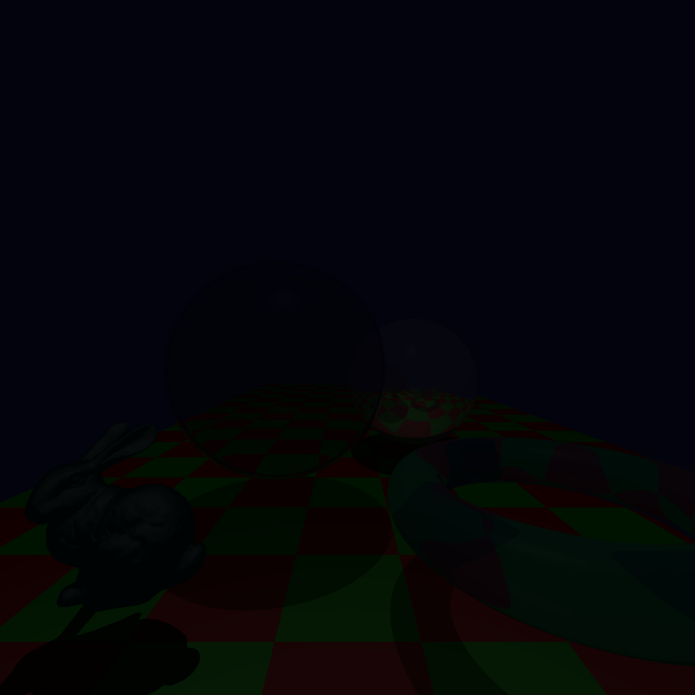
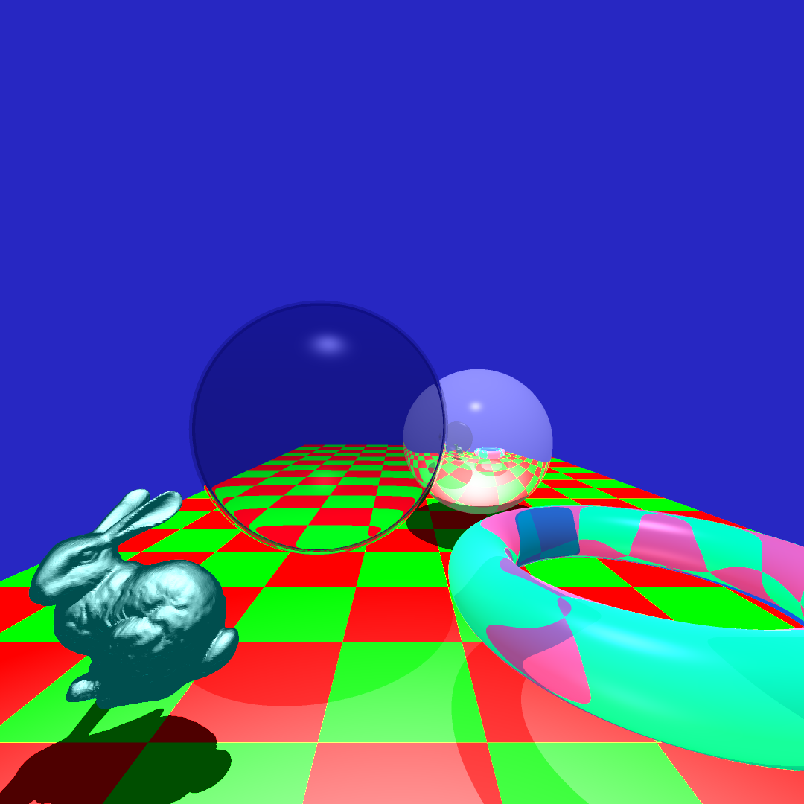
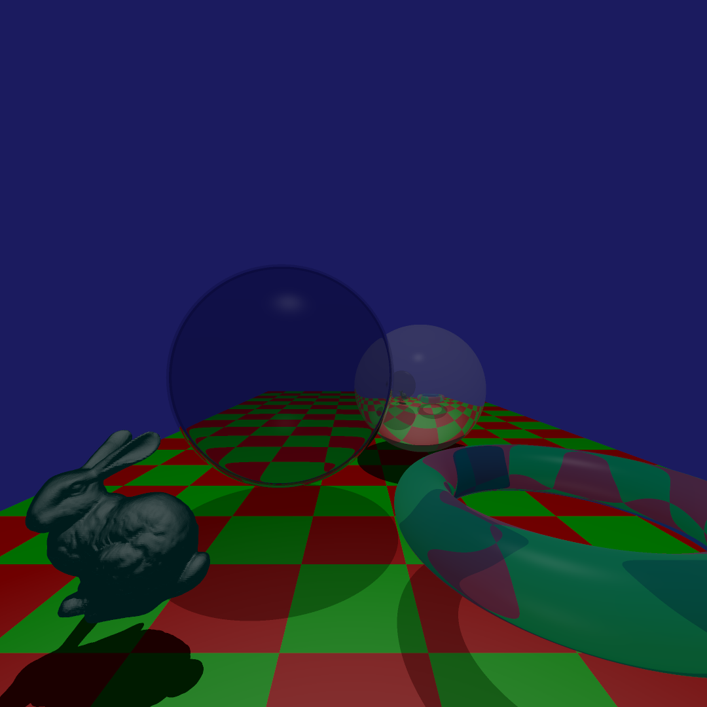
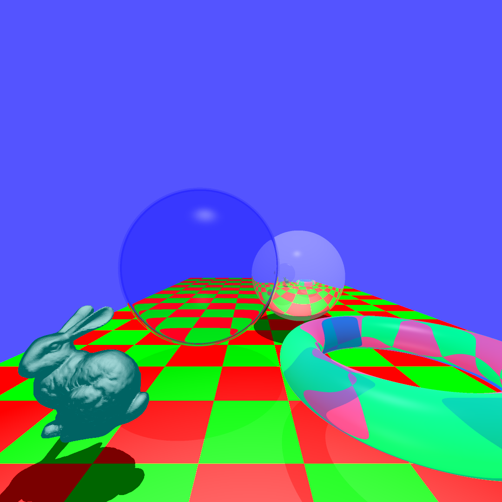

From left to right intensity of 1/10th lighting, 1 lighting, 2 lighting using Ward tone reproduction
  
Same as above, but with Reinhard

ADV CHECKPOINT: K-d tree:

Image with the highest polygon count bunny, took 14 seconds to render with Kd tree. Witout Kd tree, after 10 hours les then 0.1% of pixels were rendered.

ADV CEHCKPOINT: Tone reproduction:
Light intensity of 1, on left Ward tone reproduction, on right adaptive logarithmic

